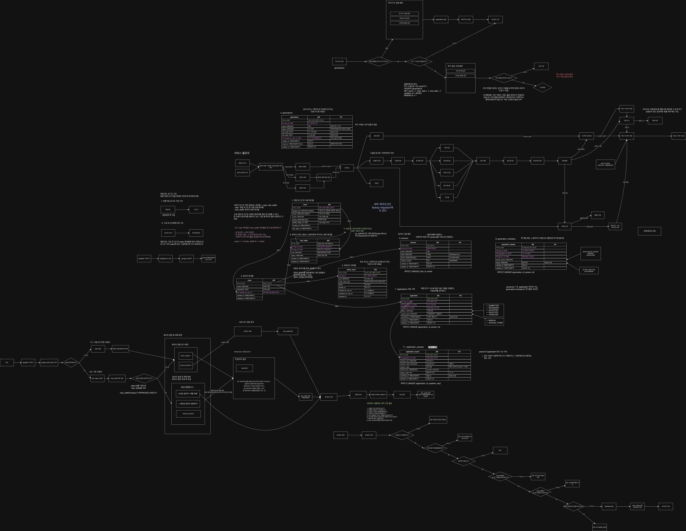

# 인증과 동아리 진입 흐름

## 목적

운영진은 Google 계정으로 로그인하고, 승인된 동아리 권한에 따라 관리 화면에 진입합니다. 지원자와 부원은 로그인 대상이 아닙니다.

## 로그인 흐름

```text
React 로그인 화면
  → GET /oauth2/authorization/google
  → Google 로그인 및 동의
  → GET /login/oauth2/code/google
  → GoogleOidcUserService
  → users 생성 또는 프로필 갱신
  → 서버 세션(JSESSIONID) 생성
  → http://localhost:5173/auth/callback
```



## 로그인 후 분기

프론트엔드는 `GET /api/auth/me`로 로그인 상태를 확인한 뒤 접근 가능한 동아리를 조회합니다.

```text
동아리 0개 → /clubs/new
동아리 1개 → /clubs/{clubId}/dashboard
동아리 2개 이상 → /clubs
```

동아리를 처음 생성하면 생성자에게 `PRESIDENT/APPROVED` 권한이 같은 트랜잭션에서 부여됩니다.

## 보안 정책

- Google 사용자는 이메일이 아니라 OIDC `sub`로 식별합니다.
- `email_verified=true`인 Google 계정만 허용합니다.
- 인증 정보는 브라우저 저장소가 아니라 서버 세션으로 관리합니다.
- API 요청은 `JSESSIONID` 쿠키를 포함합니다.
- 쓰기 요청은 `GET /api/auth/csrf`에서 받은 CSRF 토큰을 헤더에 포함합니다.
- `club_staffs.status=APPROVED`인 운영진만 해당 동아리 데이터에 접근합니다.
- 로그아웃은 `POST /api/auth/logout`으로 처리하고 세션과 쿠키를 제거합니다.

## 관련 코드

- 백엔드: `backend/src/main/java/com/clubflow/backend/auth/`
- 프론트엔드: `frontend/src/auth/`, `frontend/src/api/auth.ts`
- 권한 모델: `docs/product/data-model.md`
